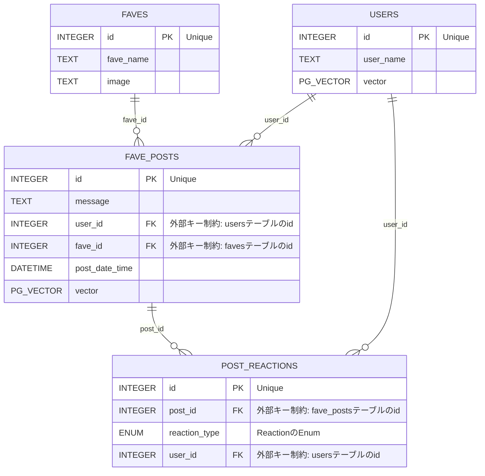

# バックエンド
AWS Lambda関数のPythonコードを保存しています。
ファイル名は[APIエンドポイント・Lambda関数](#api-エンドポイントlambda関数)の各lambda関数名の`-`を`_`に変えた文字列です。

## API エンドポイント・Lambda関数
`{parameterName}`はパスパラメータを表す。
| エンドポイント                                                 | HTTPメソッド | リクエストボディ           | レスポンス                                                                                   | 説明                                                                                                                                                                            | lambda関数名                                                    |
| -------------------------------------------------------------- | ------------ | -------------------------- | -------------------------------------------------------------------------------------------- | ------------------------------------------------------------------------------------------------------------------------------------------------------------------------------- | --------------------------------------------------------------- |
| `/api/users/{userName}`                                        | POST         | なし(エンドポイントで指定) | status-code: 200(ログイン成功) or 201(新規登録成功)                                          | ログイン用のエンドポイント。<br>登録されてないuserNameだと新規登録される。                                                                                                      | [kosamax-app-login](./kosamax_app_login.py)                     |
| `/api/timeline/{userName}`                                     | GET          |                            | status-code: 200(成功) or 404(存在しないuserName)<br>[favePostのjson](#favepostのjson)の配列 | 各ユーザーのパーソナライズされたタイムラインを取得するエンドポイント。<br>フロント側で画面更新の際に呼ぶ。                                                                      | [kosamax-app-get-timeline](./kosamax_app_get_timeline.py)       |
| `/api/favePosts/{userName}`                                    | GET          |                            | status-code: 200(成功) or 404(存在しないuserName)<br>[favePostのjson](#favepostのjson)の配列 | 自分が投稿した投稿一覧を取得する。                                                                                                                                              | [kosamax-app-get-faveposts](./kosamax_app_get_faveposts.py)     |
| `/api/favePosts/{userName}`                                    | POST         | json型(favePost)           | status-code: 200(成功)                                                                       | 新しい布教コメントを投稿する。<br>「投稿する」ボタンを押したときに呼ぶ。                                                                                                        | [kosamax-app-add-favepost](./kosamax_app_add_favepost.py)       |
| `/api/favePosts/{userName}/{postId}/reactions/{reactionsType}` | POST         |                            | status-code: 200(成功)                                                                       | 投稿にリアクション（いいね！、見たよ！）するときに呼ぶ。                                                                                                                        | [kosamax-app-add-reaction](./kosamax_app_add_reaction.py)       |
| `/api/faves`                                                   | GET          |                            | status-code: 200(成功)<br>[faveのjson](#faveのjson)の配列                                    | 推しVtuberの名前とid一覧を取得<br>(Favesテーブルの一覧をjsonで返す)                                                                                                             | [kosamax-app-get-faves](./kosamax_app_get_faves.py)             |
| `/api/favePosts/{userName}/{postId}`                           | DELETE       |                            | status-code: 200(成功)                                                                       | ユーザーが投稿した布教コメントを削除する。                                                                                                                                      | [kosamax-app-delete-favepost](./kosamax_app_delete_favepost.py) |
| エンドポイントなし(AWS CloudWatch Eventsでスケジュール駆動)    |              |                            |                                                                                              | 投稿された布教コメントの文ベクトル(意味ベクトル)を計算するLambdaバッチ関数。<br>各ユーザーが投稿した布教コメントからユーザーベクトルを計算し、[usersテーブル](#users)で紐づける | [fave-embedding-batch](./fave_embedding_batch.py)               |


## JSONオブジェクトのテンプレート
フロントエンドとバックエンドの間でデータを受け渡す際のJSONの構造
### faveのjson
投稿画面の推しVtuber名の候補表示のためにバックエンド(``)からフロントエンドにVtuberの情報を受け渡すためのテンプレート
```json
[
	{
		"fave_id":"推しVtuberのid(Favesテーブル)",
		"fave_name":"推しVtuberの名前"
	}
]
```

### favePostのjson
フロントエンドに投稿データを受け渡す際のテンプレート
（api、機能に応じて不要なキーを省略可）
```json
[
	{
		"id":"postのid"
		"message":"布教コメント",
		"fave_id":"推しVtuberのid(Favesテーブル)"
		"date_time":
		"post_by":"投稿したユーザーのid(Usersテーブル)"
		"img":"base64の画像文字列"
		"reactions" : {
			"like":"いいね👍した人の数"
			"watch":"見たよ👀した人の数"
			"love":"好き💘した人の数"
			"new_listener":"リスナーになったよ！した人の数"
		}
	}
]
```


## データベース設計
1列目がPRIMARY KEY

### users
ユーザーの基本情報と嗜好ベクトルを保存
| id                | user_name | vector    |
| ----------------- | --------- | --------- |
| integer(SEQUENCE) | text      | pg_vector |

### fave_posts
FAVEに投稿された全投稿の情報と投稿文のベクトルを保存
| id                | message | user_id                                   | fave_id                                   | post_date_time | vector    |
| ----------------- | ------- | ----------------------------------------- | ----------------------------------------- | -------------- | --------- |
| integer(SEQUENCE) | text    | integer (外部キー制約: usersテーブルのid) | integer (外部キー制約: favesテーブルのid) | timestamp      | pg_vector |

### post_reactions
リアクションの履歴を保存
| id                | post_id                                        | reaction_type                             | user_id                                   |
| ----------------- | ---------------------------------------------- | ----------------------------------------- | ----------------------------------------- |
| integer(SEQUENCE) | integer (外部キー制約: fave_postsテーブルのid) | [reaction_type](#reaction_typeのenumtype) | integer (外部キー制約: usersテーブルのid) |

### reaction_typeのEnumType
`reaction_type`はPostgres SQLのENUM型で定義
```sql
CREATE TYPE reaction_type AS ENUM ('like', 'watch', 'love', 'new_listener')`
```

### faves
ユーザーが投稿できる推しVtuberの情報を保存
| id                | fave_name | image |
| ----------------- | --------- | ----- |
| integer(SEQUENCE) | text      | text  |


### ER図

